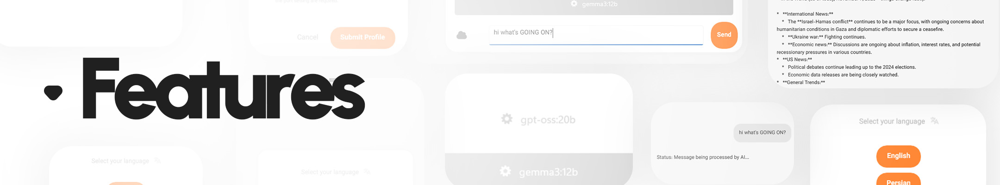

  

<h1>
  
    Bloby AI
</h1>
Bloby AI is a modern cross-platform AI client built with .NET MAUI that connects directly to the Ollama API. Simply enter your Ollama server address, choose any installed model, and start chatting with your local AI.

  

## Features

- Connect to any Ollama server using its IP address.
- Automatically retrieve and display installed models.
- Chat with any available Ollama model.
- Modern and intuitive user interface.
- Persian and English language support.
- Fast and lightweight experience.
- Cross-platform application built with .NET MAUI.

## How It Works

1. Enter your Ollama server IP address.
2. Connect to the Ollama API.
3. Select one of the available models.
4. Start chatting instantly.

## Technology

- .NET MAUI
- C#
- MVVM Architecture
- Ollama REST API

## Requirements

- A running Ollama server.
- Network access to the server.
- At least one installed Ollama model.

## License

This project is licensed under the MIT License.
